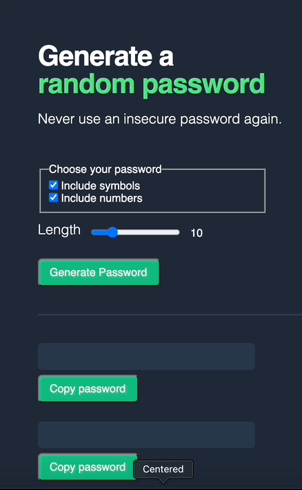

# Random Password Generator
One click to generate passwords up to 30 characters in length with choices of include symbols and numbers

[Site Live](https://tiny-mochi-3e1c9c.netlify.app/)

## Module
A training project built to consolidate key concepts from:

**Module 7 - Next Level JavaScript** [Scrimba Frontend Career Path Course](https://scrimba.com/learn/frontend) 

## Lesson
- Practice using Math.random()
- Build site according to Figma design spec 
- conditionally & randomlly select characters based on user input

## Demo
 

